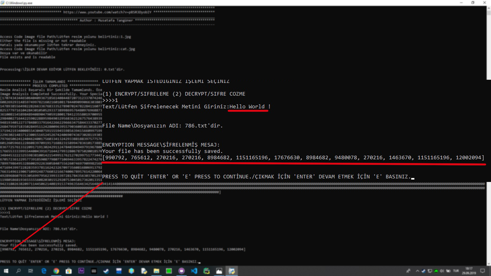
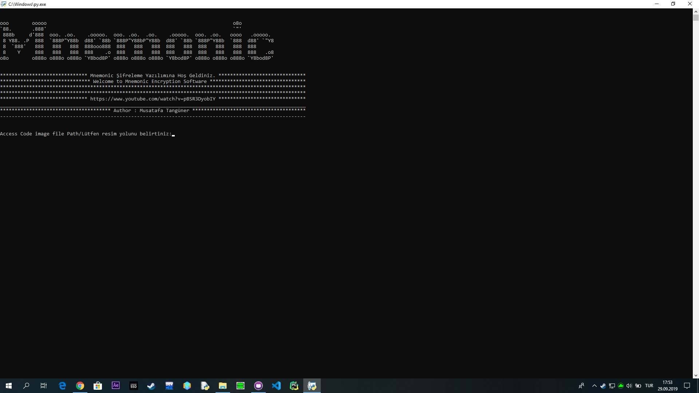
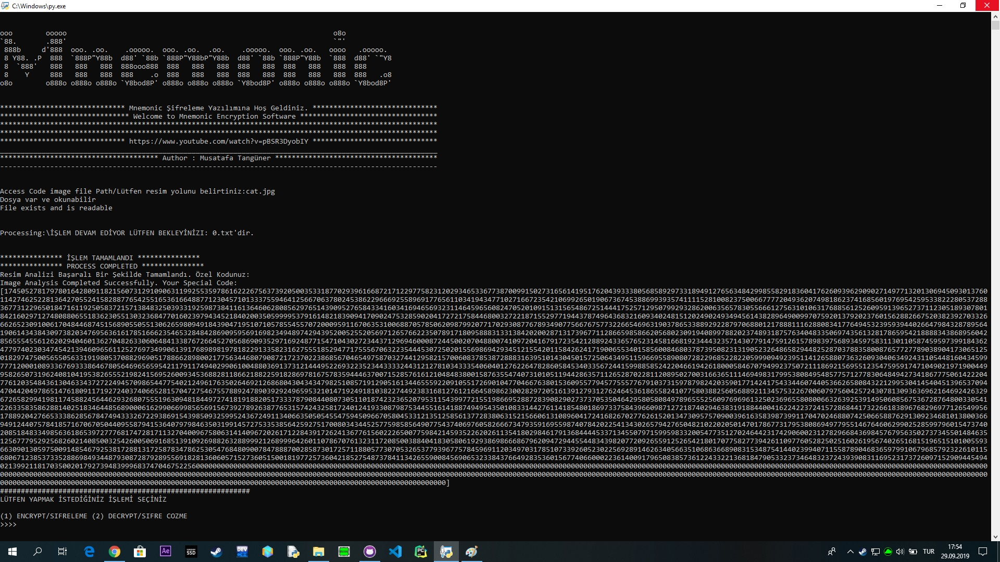
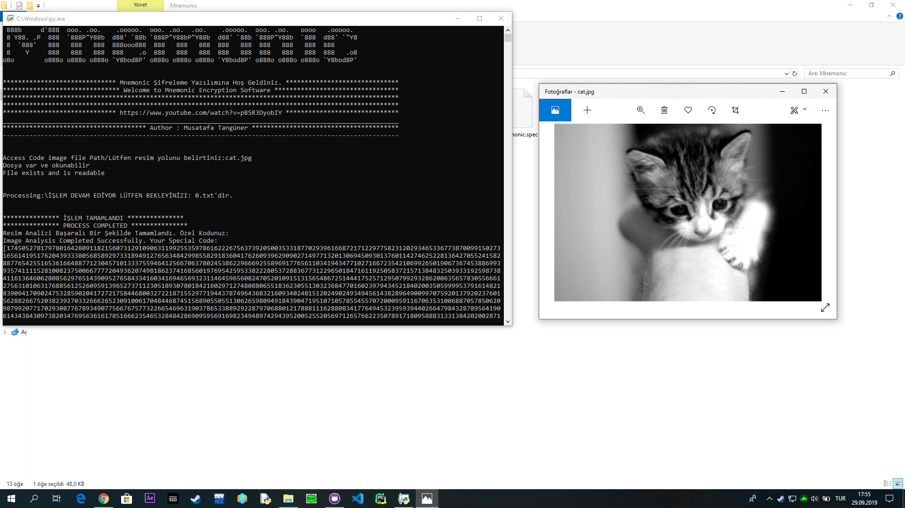
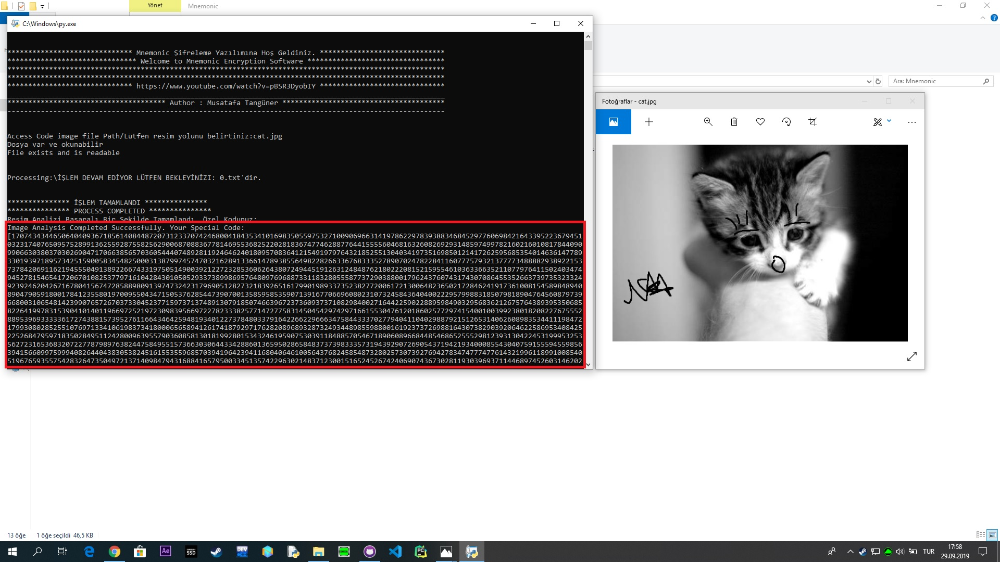
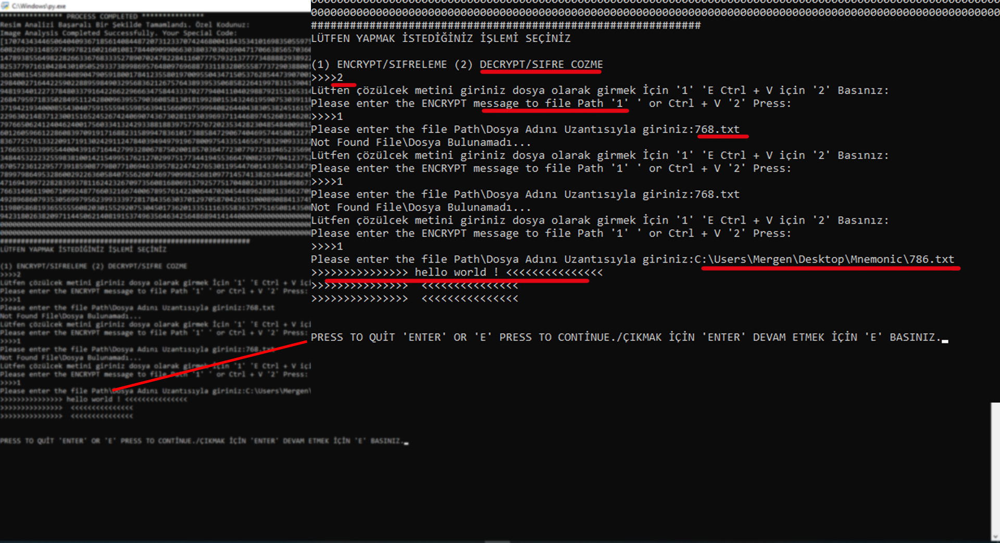

# Mnemonic Cryptography

### Mnemonic is İmage - Based Encryption.

### How is it working
User is adding a picture  anything can happen and Mnemonic it takes the pixel values of the entered image and calculates
it creates a special access code from the picture.

Because the values of each picture will be different.so when decryption you should only have the same picture .

Note:Use an image higher than 72 dpi Otherwise it won't work ...

https://www.youtube.com/watch?v=pBSR3DyobIY

## Required modules
apt-get install python3
#
apt-get install python3-pip
#
pip3 install opencv-python
#
python3 Mnemonic.py
#

#I entered the path to the picture.

# if you make changes to the picture. access code also changed

