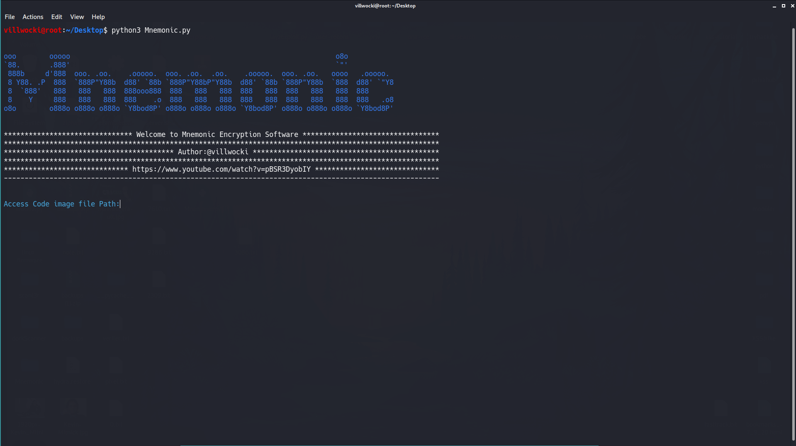
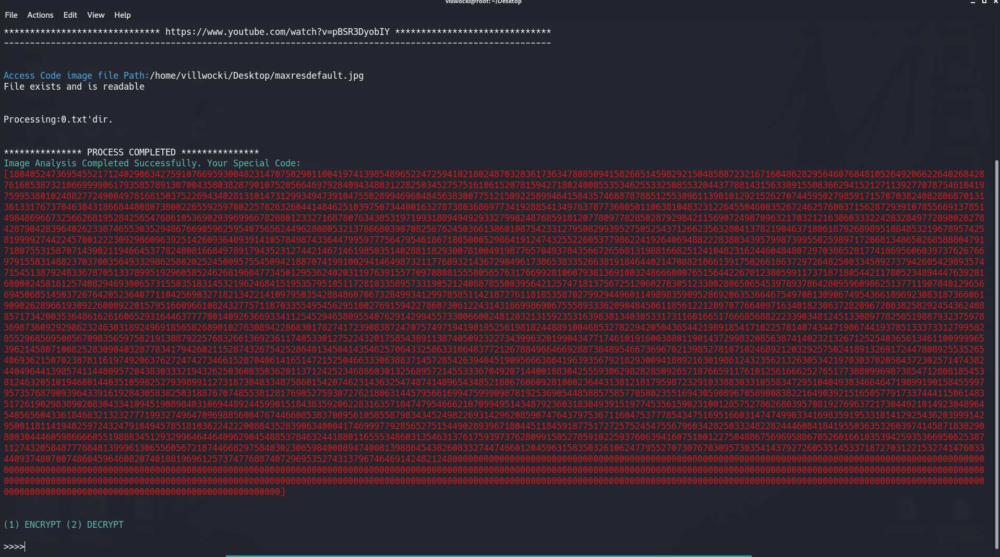
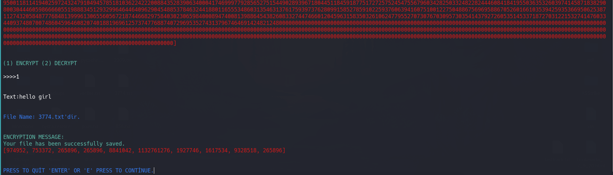
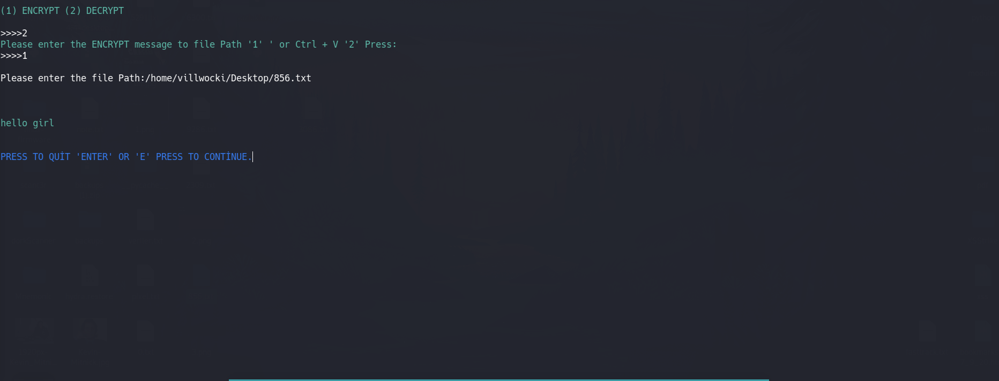

# Mnemonic Cryptography

### Mnemonic is İmage - Based Encryption.

### How is it working
User is adding a picture  anything can happen and Mnemonic it takes the pixel values of the entered image and calculates
it creates a special access code from the picture.

Because the values of each picture will be different.so when decryption you should only have the same picture .


Note:Use an image higher than 72 dpi Otherwise it won't work ...

https://www.youtube.com/watch?v=pBSR3DyobIY

## Required modules
- pip for Python3
```bash
apt-get install python3-pip
```
- colored for Python3
```bash
pip3 install colored
```
- OpenCV for Python
```bash
pip3 install opencv-python
```

## Usage
to run project:
```bash
python3 Mnemonic.py
```



#I entered the path to the picture.




